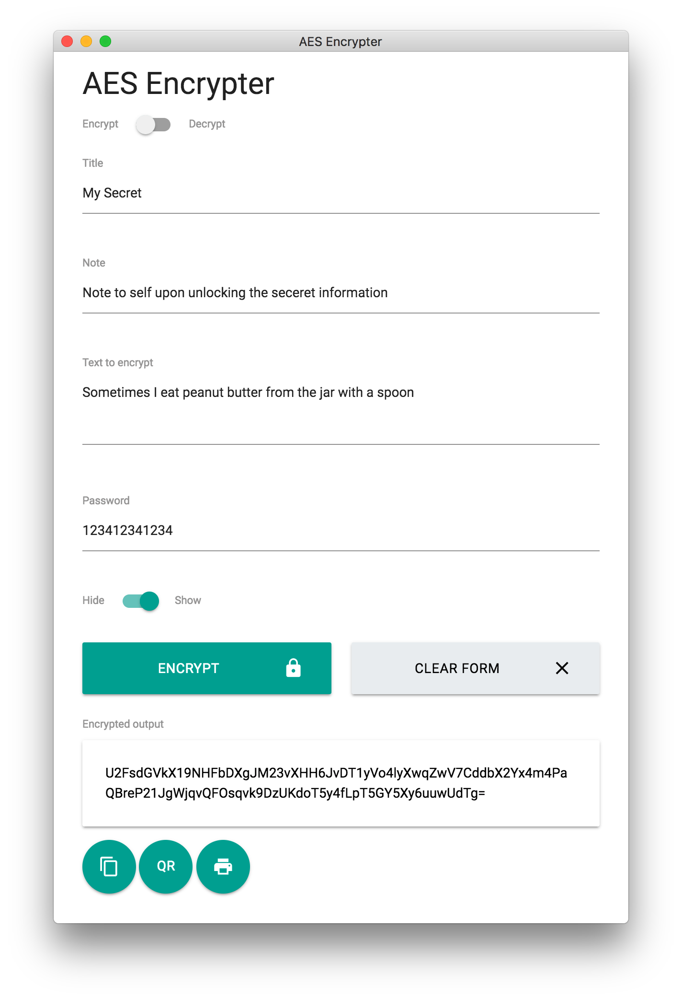
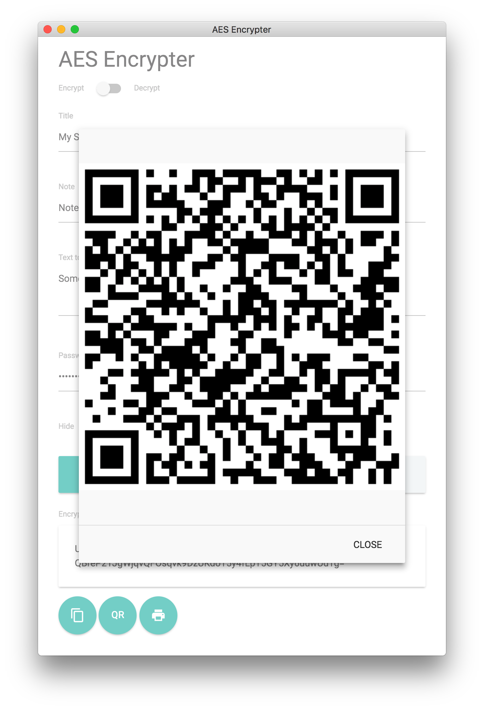
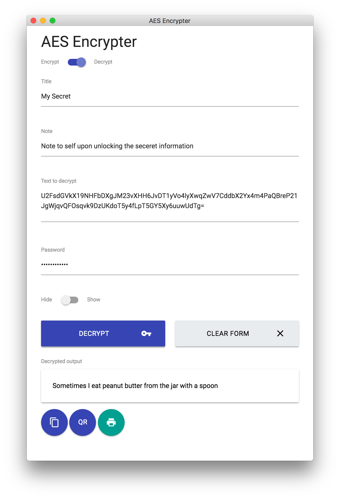

## AES Encrypter to keep your secrets safe

Simple AES Encryption tool to password protect any information. It can encrypt as well as decrypt, render a QR code of the encrypted information and also print a formatted page with all the relevant data to a PDF file or printer.

Inputting your private keys into third party software can be a great way to get your keys stolen by malicious actors. Please use this tool with extreme caution. Check the checksum and signature before using this software. 

You or other software engineers whom you trust can review the code and compile it from source yourself. 

All encryption is done locally, nothing is broadcast. This application can be used completely offline. 

As an added layer of security / paranoia, you can run this software offline inside a VM or USB booted operating system (which is subsequently destroyed) to make absolutely sure it doesn't broadcast anything.

This software is free, open source and provided under the [MIT license](https://opensource.org/licenses/MIT)

### Test data

Unencrypted Data: Sometimes I eat peanut butter from the jar with a spoon

Encrypted Data: U2FsdGVkX19NHFbDXgJM23vXHH6JvDT1yVo4lyXwqZwV7CddbX2Yx4m4PaQBreP21JgWjqvQFOsqvk9DzUKdoT5y4fLpT5GY5Xy6uuwUdTg=

Password: 123412341234

<object data="example/output.pdf" type="application/pdf" width="700px" height="700px">
    <embed src="example/output.pdf">
        This browser does not support PDFs. Please download the PDF to view it: <a href="example/output.pdf">Download Example PDF</a>.

    </embed>
</object>

### Important Notes

Double clicking the output text and using using the copy command results in content_copy being appended to the copied output. Use the copy button instead to copy the output to the clipboard.

The encrypted data written to the PDF is required to wrap on the lines, but this introduces a space character between each line when copying the encrypted data from the PDF. Remove these extra spaces otherwise the decryption won't work.

If you're encrypting a long piece of data, the QR code can sometimes be split over pages 1 and 2 when printing to PDF. You can always bring the QR code up inside the app and take a screen shot or clipping to capture the QR if you have any issues.

Remember to always test the decryption works before destroying any important plain text data.

Never lose your password or your data will be lost.
